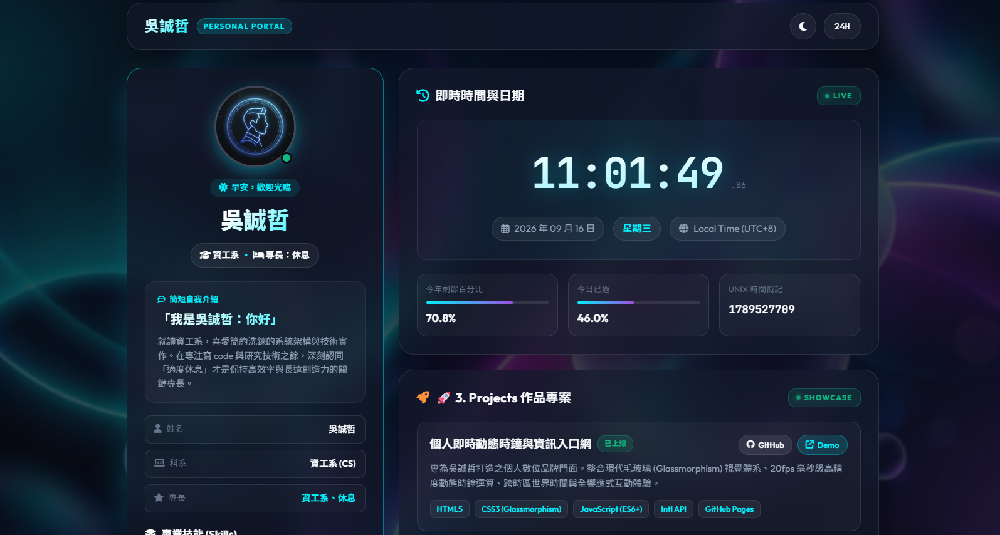
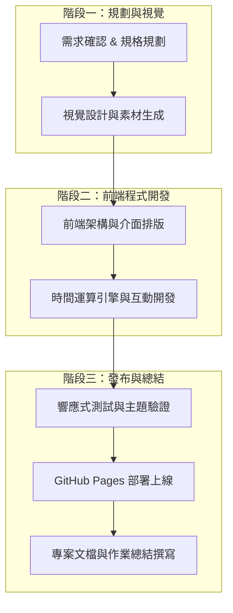

# 吳誠哲 個人首頁 & 即時動態時鐘 (Wu Cheng-Che Personal Hub)

✨ **一個結合現代毛玻璃視覺美學 (Glassmorphism)、高精度即時時鐘、個人簡介與作品集展示的動態個人首頁。**


---

## 🔗 線上展示 (Live Demo)

- **Demo 連結**：[https://cheeefds.github.io/0916/](https://cheeefds.github.io/0916/)



---

## 👤 個人簡介 (About Me)

- **姓名**：吳誠哲 (Wu Cheng-Che)
- **頭像**：專屬個人科技頭像 ([assets/avatar.jpg](assets/avatar.jpg))
- **科系 / 專長**：**資工系**、**休息**
- **簡短自我介紹**：
  > **「我是吳誠哲：你好」**  
  就讀資工系，喜愛簡約洗鍊的系統架構與技術實作。在專注寫 code 與研究技術之餘，深刻認同「適度休息」才是保持高效率與長遠創造力的關鍵專長。

---

## ⚡ 專業技能 (Skills)

至少包含 3 項核心專業技能：

1. **Python**
   - 熟悉演算法實作、資料分析、後端串接與自動化腳本撰寫。
2. **C / C++**
   - 系統底層程式設計、資料結構與高效能演算法運算。
3. **Machine Learning**
   - 機器學習演算法、資料特徵工程與模型訓練評估。

---

## 🚀 3. Projects (作品與專案展示)

### 📌 Project 1: 個人即時動態時鐘與資訊入口網 (Personal Portal & Clock Hub)
- **Project Name**：個人即時動態時鐘與資訊入口網
- **Project Description**：專為吳誠哲打造之個人數位品牌門面。整合現代毛玻璃 (Glassmorphism) 視覺體系、20fps 毫秒級高精度動態時鐘運算、跨時區世界時間與全響應式互動體驗。
- **使用技術**：`HTML5`、`CSS3 (Glassmorphism, RWD)`、`JavaScript (ES6+)`、`Intl API`、`GitHub Pages`
- **GitHub Link**：[https://github.com/cheeefds/0916](https://github.com/cheeefds/0916)
- **Live Demo**：[https://cheeefds.github.io/0916/](https://cheeefds.github.io/0916/)

### 📌 Project 2: 智慧時序數據分析與異常偵測系統 (Smart Time-Series ML Model) *(本學期預計完成)*
- **Project Name**：智慧時序數據分析與異常偵測系統
- **Project Description**：結合資工系專業，以 Python 深度學習架構結合 C/C++ 演算法加速模組，針對時間序列數據進行特徵提取、異常模式識別與未來趨勢智慧預測。
- **使用技術**：`Python`、`C / C++`、`Machine Learning`、`PyTorch / Scikit-Learn`
- **GitHub Link**：[https://github.com/cheeefds](https://github.com/cheeefds)

---

## 🌟 核心功能亮點 (Key Features)

### 1. ⏱️ 實時高精度時鐘 (Live Precision Clock)
- **毫秒級數字時鐘**：流暢顯示時、分、秒與毫秒演進。
- **雙制式切換**：支援 24 小時制 (`24H`) 與 12 小時制 (`12H AM/PM`) 自由切換。
- **完整日期與時區**：支援 Traditional Chinese 格式（年/月/日/星期）與 `Asia/Taipei` (UTC+8) 時區顯示。

### 2. 📊 時間維度與指標 (Time Metrics)
- **年度進度條 (Year Progress %)**：即時算出一整年已過去的百分比。
- **今日進度條 (Day Progress %)**：計算今日已度過的時間比例。
- **Unix Timestamp**：提供開發者常用的秒級 Unix 時間戳記。

### 3. 🌍 世界主要城市時鐘 (World Clock Grid)
- 內建四區即時時鐘連動：**台北 (Taipei)**、**東京 (Tokyo)**、**倫敦 (London)**、**紐約 (New York)**。

### 4. 🎨 視覺美學與主題切換 (Design System)
- **深/淺色主題 toggle**：可隨時在「賽博深色毛玻璃 (Cyberpunk Dark)」與「極簡純白 (Modern Light)」主題間切換。
- **每日時間感悟**：收錄時間金句，提供互動換句體驗。

---

## 🛠️ 技術棧 (Tech Stack)

- **前端核心**：HTML5, Vanilla JavaScript (ES6+)
- **樣式設計**：CSS3 (CSS Variables, Flexbox, CSS Grid, Modern Backdrop-Filter)
- **字型庫**：Google Fonts ([Outfit](https://fonts.google.com/specimen/Outfit), [Noto Sans TC](https://fonts.google.com/specimen/Noto+Sans+TC), [JetBrains Mono](https://fonts.google.com/specimen/JetBrains+Mono))
- **圖示庫**：[FontAwesome 6](https://fontawesome.com/)

---

## 📁 專案結構 (Directory Structure)

```text
personal page/
├── index.html          # 主頁面結構與語意標籤
├── styles.css          # 全局樣式、毛玻璃特效與深淺主題變數
├── script.js           # 時間引擎、動態數據計算與互動事件處理
├── assets/             # 圖像資源
│   ├── avatar.jpg      # 個人專屬頭像
│   ├── demo_snapshot.png # 網頁展示截圖
│   └── hero_bg.jpg     # 深色視覺背景圖
└── README.md           # 專案說明文件
```

---

## 🚀 快速啟動 (Quick Start)

無需複雜安裝，下載或複製本專案後即可直接執行：

### 方法一：直接於瀏覽器開啟
1. 進入專案目錄。
2. 雙擊 `index.html` 即可在瀏覽器開啟並使用完整功能。

### 方法二：透過本地 HTTP 伺服器運行
如需以 Localhost 方式檢視：

- **使用 Python 伺服器**：
  ```bash
  python -m http.server 8080
  ```
  於瀏覽器造訪 `http://localhost:8080`

- **使用 Node.js / npx**：
  ```bash
  npx http-server -p 8080
  ```

---

## 📝 DIC(Do In Class 1)-課堂實作總結

> 本章節為本次個人專案作業開發流程與成果總結，展示從需求分析到部署上線的完整流程。

### 1. 開發工作流程圖 (Development Workflow)



---

### 2. 今日工作歷程與具體實作項目

| 階段 | 工作重點 | 具體成果與產出 |
| :--- | :--- | :--- |
| **一、需求分析** | 明確個人品牌與功能訴求 | 定義核心展示項目（姓名：吳誠哲、科系：資工系、專長：休息、自我介紹、3項技能、專案作品、毫秒級時鐘與指標）。 |
| **二、視覺與素材** | 建立暗黑科技與毛玻璃風格 | 產生專屬質感深色霓虹幾何背景 (`hero_bg.jpg`) 與個人頭像風格圖 (`avatar.jpg`)。 |
| **三、版面架構 (HTML/CSS)** | 建立語意化標籤與響應式排版 | 使用 HTML5 語意標籤與 CSS Grid/Flexbox 完成卡片網格；採用 `backdrop-filter` 實現現代毛玻璃 (Glassmorphism) 效果。 |
| **四、功能邏輯 (JavaScript)** | 即時運算與互動機制實作 | 1. 20fps 高精度即時時鐘（包含毫秒顯示與 12H/24H 切換）。<br>2. 智慧時段問候語（早安 / 午安 / 晚安）。<br>3. 年度與當日時間進度百分比計算。<br>4. 跨時區世界時鐘（台北、東京、倫敦、紐約）。<br>5. 深色／淺色主題即時切換系統。<br>6. 時間感悟語錄隨機切換。 |
| **五、成果部署** | 靜態網站發布 | 透過 GitHub Pages 發布上線，提供公開線上體驗網址。 |
| **六、說明文件** | 整理作業成果與文檔 | 完成結構化 `README.md`，納入個人資訊、技能清單、專案展示、Live Demo 連結、展示截圖與開發流程總結。 |

---

### 3. 技術收穫與學習亮點

1. **原生前端能力強化 (Vanilla Frontend)**：不依賴龐大框架，純粹利用 HTML5、CSS3 與原生 ES6+ JavaScript 打造出具備高質感與順暢性能的互動網站。
2. **現代 CSS 視覺設計**：深入實踐 CSS 變數系統（CSS Custom Properties）、毛玻璃濾鏡 (`backdrop-filter: blur()`)、微互動發光漸層與響應式斷點設計。
3. **高精度計時與效能兼顧**：藉由高頻定時器與 `Intl.DateTimeFormat` 處理多時區計算，並實時計算年度進度與 Unix 時間戳記。
4. **完整工程閉環**：涵蓋需求、設計、編程、版本控制、線上部署至技術文檔撰寫，具備完整且專業的開發交付規範。

---

## 📄 授權條款 (License)

本專案採用 [MIT License](LICENSE) 授權發行。
